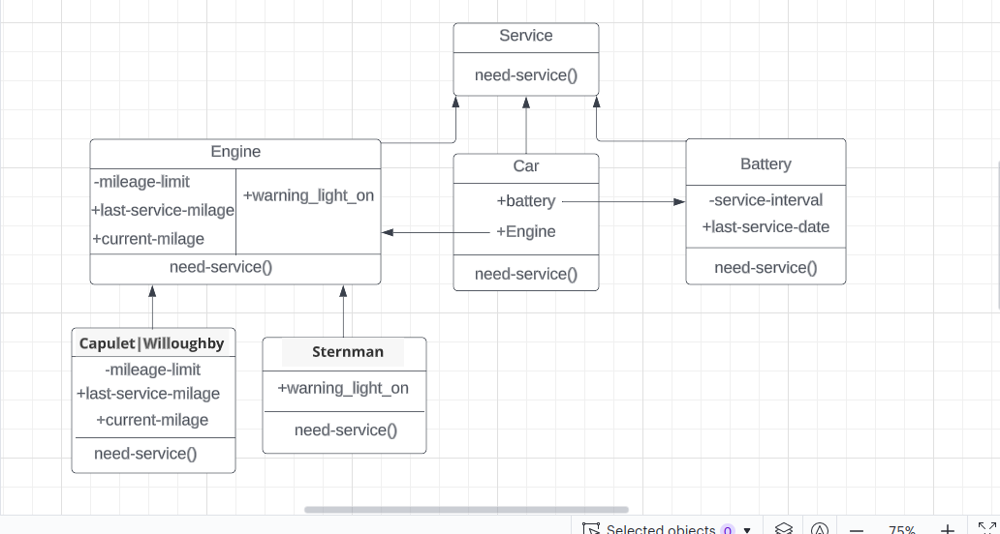

# Project Summary

The core objectives of this project are:

- Come up with a clean design for an existing, unfinished component
- Refactor a messy [forage-lyft-starter-repo codebase](https://github.com/vagabond-systems/forage-lyft-starter-repo)
- Write unit tests for your newly refactored system
- Add new functionality to your system using Test-Driven Development

## System Service Criterias and Models

#### Service Criterias

| Engine | Criteria |
| ------ | -------- |
| Capulet | Once every 30,000 miles |
| Willoughby | Once every 60,000 miles |
| Sternman | 	Only when the warning indicator is on |

| Battery | Criteria |
| ------- | -------- |
| Spindler | Once every 2 years |
| Nubbin | Once every 4 years |

#### Car Models

| Car | Engine | Battery |
| --- | ------ | ------- |
| Calliope | Capulet Engine | Spindler Battery |
| Glissade | Willoughby Engine | Spindler Battery |
| Palindrome | Sternman Engine | Spindler Battery |
| Rorschach | Willoughby Engine | Nubbin Batte |
| Thovex | Capulet Engine | Nubbin Battery |

## Desired System Architecture After Refactor
